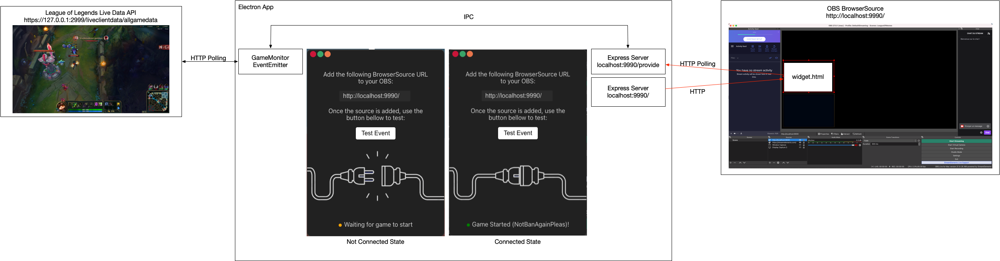

League of Memes
----

League of Memes goal is to, whenever an important event related to our character happens on League of Legends, we want to trigger a video clip, which the user can configure. This should allow for some cool moments as a player streams League of Legends with its community.

### General Architecture

League of Memes is an Electron App, which exposes an express server at `http://localhost:9990` to be used as a BrowserSource in OBS.



### Requirements

Precompiled binaries are available for the following platforms:

   - Windows 7 or above (64-bit)
   - macOS sierra or above (64-bit)

*Note: 32-bit is unsupported.*

### Building

#### Prerequisites
 - [Yarn 1.x.x](https://classic.yarnpkg.com/lang/en/)
 
#### Install dependencies
```SHELL
yarn install
```

#### Start Development
```shell
yarn dev
```

#### Build

This will yield a packaging for your application depending on the OS you are running the command from.

```shell
yarn build
```
